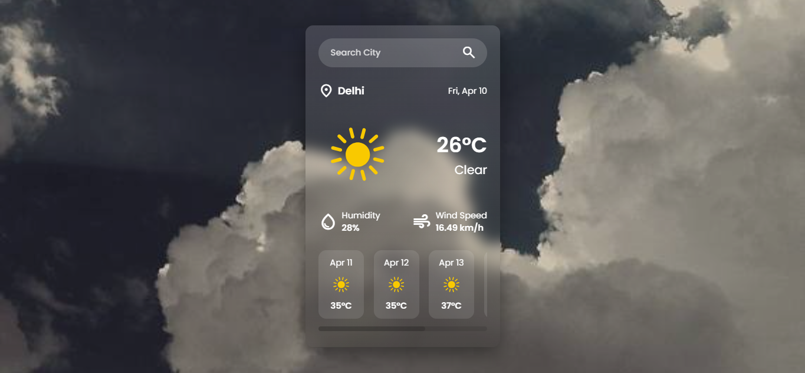

# 🌤️ Modern Weather Dashboard

A sleek and responsive weather application that provides real-time meteorological data and a 5-day forecast using the OpenWeatherMap API.

## 🔗 Live Demo

> **Check out the live app here:** [🚀 View Project Live](https://your-username.github.io/your-repo-name/)

## ✨ Key Features

- **Global Search:** Fetch real-time weather data for any city worldwide.
- **Keyboard Accessibility:** Optimized for speed with **Enter Key Support** for instant searches.
- **Detailed Metrics:** Displays temperature, humidity, and wind speed (accurately converted to km/h).
- **Extended Forecast:** Dynamic 5-day weather outlook with high-quality daily condition icons.
- **Adaptive UI:** Modern glassmorphism design with a fully responsive layout for mobile and desktop devices.
- **Smart Error Handling:** Custom alerts for invalid city names or network failures.

## 🛠️ Technical Implementation

- **Frontend:** Semantic HTML5, CSS3 (Custom Scrollbars, Flexbox, Glassmorphism).
- **Logic:** Vanilla JavaScript (ES6+) using `async/await` for asynchronous API communication.
- **Input Handling:** Implemented Event Listeners for both `click` and `keydown` (Enter key) to improve UX.
- **API Integration:** Leverages the [OpenWeatherMap API](https://openweathermap.org/api) for precise, real-time data.

## 📸 Interface Preview



## 🚀 Installation & Usage

1.  **Clone the Repository:**
    ```bash
    git clone  (https://github.com/Meer-Aaqib/weather-forecast-app.git)
    ```
2.  **API Configuration:**
    - Sign up at OpenWeatherMap to get your API Key.
    - Replace the `apiKey` variable in `script.js` with your unique key.
3.  **Launch:**
    - Open `index.html` in any modern web browser.

## 📈 Future Enhancements

- [ ] Implementation of Geolocation API for automatic local weather detection.
- [ ] Unit conversion toggle (Celsius to Fahrenheit).
- [ ] Dark/Light mode theme persistence using LocalStorage.

---

## 🙌 Author

Meer Aaqib

---

## ⭐ Show Your Support

If you like this project, give it a ⭐ on GitHub!
